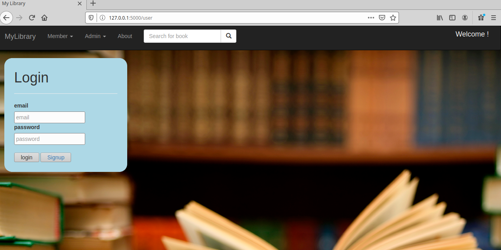
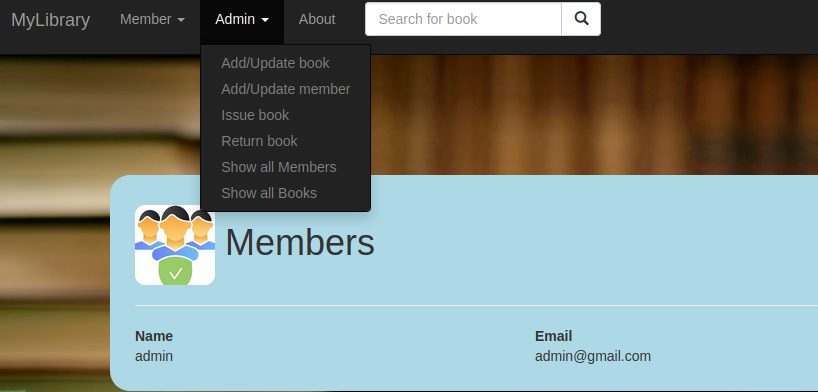
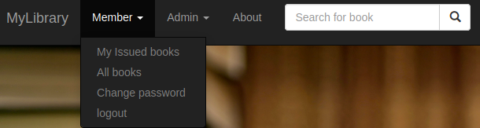
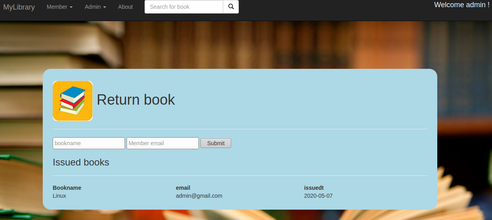

# Mylibrary
Python Flask application for library management system features like:
1. User and admin management
2. Manage books and members additions and updates

Requirements:
1. Python 3.7 or up
2. sqllite3
3. flask
4. SqlAlchemy

Installation:
1. pip install flask
2. pip install sqlalchemy

Getting Started:
1. git clone https://github.com/mdrizwan211/Library_Management_System.git
2. cd src
3. python app_run.py
4. go to http://127.0.0.1:5000/ in your browser

Default admin credentials: 
1. email: admin@gmail.com
2. password: admin

Sample screenprints:
1. Admin options: 
To access admin options login using provided default admin credentials

2. Member Options:

3. Return book activity:

